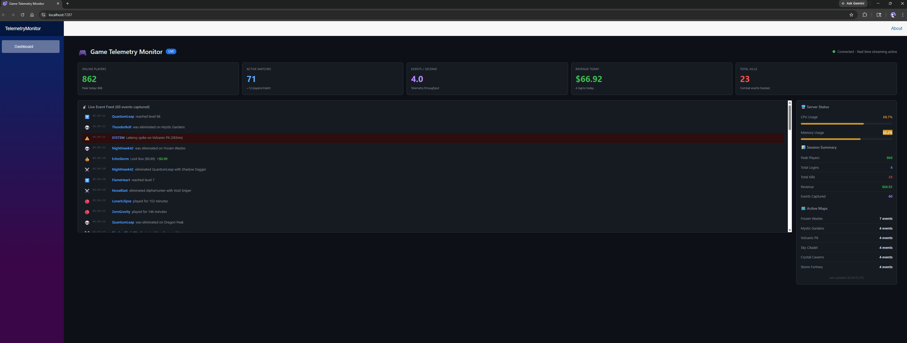
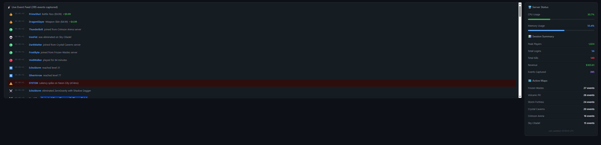

# GAME TELEMETRY MONITOR: REAL TIME DASHBOARD

A real-time game telemetry monitoring dashboard built with **Blazor Server** and **SignalR** streaming live player events, server metrics, revenue tracking and match activity. Events are generated, pushed and rendered in real-time with sub-second latency.



## PROJECT OVERVIEW

Live-service games generate thousands of telemetry events per second for eg. kills, deaths, purchases, logins, server errors. Studios need real-time monitoring dashboards to track game health, revenue and player activity as it happens.

This project implements a full real-time telemetry system:
- **Background service** generates realistic game events at 2-5 events/second
- **SignalR hub** pushes events instantly to all connected browser clients
- **Blazor Server dashboard** renders a live-updating event feed, KPI metrics, server health gauges, and map activity all without page refreshes

## FEATURES

### Real-Time Event Stream
- **Live event feed** with color-coded event types: kills, deaths, purchases, logins, logouts, level ups, achievements, server Errors
- Events appear with **fade-in animation** the instant they occur
- Purchase events show **dollar amounts** in green
- Server errors are highlighted with **red background** for immediate visibility
- Feed maintains the **last 500 events** in memory

### Live KPI Metrics
- **Online Players** with peak count tracking
- **Active Matches** with players per match calculation
- **Events Per Second** ie real-time telemetry throughput
- **Revenue Today** - cumulative purchase tracking
- **Total Kills** - combat event counter
- All metrics update every 2 seconds via SignalR push

### Server Health Monitoring
- **CPU and Memory usage** with color coded progress bars (green/yellow/red thresholds)
- **Session summary** - peak players, total logins, kills, revenue, events captured
- **Active maps** - ranked by event frequency, showing where players are concentrating

### Connection Management
- **Auto-reconnect** - if the connection drops, SignalR automatically reconnects
- **Connection status indicator** - green dot when connected, red when disconnected



## ARCHITECTURE

```
┌──────────────────────────────────────────┐
│          BLAZOR SERVER DASHBOARD         │
│                                          │
│  Dashboard.razor (UI)                    │
│  ├── KPI Metric Cards (auto-updating)    │
│  ├── Live Event Feed (500 events)        │
│  ├── Server Health Gauges                │
│  └── Map Activity Tracker                │
│           │                              │
│           │ SignalR Client Connection    │
└───────────┼──────────────────────────────┘
            │ WebSocket (automatic)
┌───────────┼──────────────────────────────┐
│           ▼                              │
│    TelemetryHub (SignalR Hub)            │
│    ├── ReceiveEvent → broadcasts events  │
│    └── ReceiveMetrics → broadcasts KPIs  │
│           ▲                              │
│           │ IHubContext injection        │
│           │                              │
│    TelemetryGeneratorService             │
│    (BackgroundService)                   │
│    ├── Generates 2-5 events/second       │
│    ├── Simulates player count drift      │
│    ├── Tracks revenue, kills, logins     │
│    └── Pushes via SignalR every tick     │
└──────────────────────────────────────────┘
```

### How SignalR Works Here
Traditional web apps require the browser to *ask* for updates (polling). SignalR creates a **persistent WebSocket connection** between the browser and server. When the `TelemetryGeneratorService` creates a new event, it calls `_hubContext.Clients.All.SendAsync("ReceiveEvent", event)` - this instantly pushes the event to every connected browser. No polling, no delays, no wasted requests.

## TOOLS AND TECHNOLOGIES

- **C# / .NET 8.0** - application framework
- **Blazor Server** - interactive web UI using C# (no JavaScript)
- **SignalR** - real time WebSocket communication
- **BackgroundService** - hosted service for continuous event generation
- **Dependency Injection** - IHubContext for pushing from background services

### Key Patterns Demonstrated
- **Real-time push architecture** - server to client event streaming
- **BackgroundService + SignalR** - background worker pushing to web clients
- **Auto reconnect** - resilient WebSocket connections
- **Component lifecycle management** - IAsyncDisposable for proper cleanup

## PROJECT STRUCTURE

```
game-telemetry-monitor/
├── TelemetryMonitor/
│   ├── Models/
│   │   └── TelemetryModels.cs          # GameEvent, ServerMetrics, MetricPoint
│   ├── Services/
│   │   └── TelemetryGeneratorService.cs # Background event generator
│   ├── Hubs/
│   │   └── TelemetryHub.cs             # SignalR hub
│   ├── Components/
│   │   ├── Pages/
│   │   │   └── Dashboard.razor          # Real-time dashboard UI
│   │   ├── App.razor
│   │   └── Routes.razor
│   └── Program.cs                       # Service registration + SignalR setup
├── images/
└── README.md
```

## GETTING STARTED

### Prerequisites
- .NET 8.0 SDK
- Visual Studio 2022 or VS Code

### Run
```bash
git clone https://github.com/rush2pranav/game-telemetry-monitor.git
cd game-telemetry-monitor

# Open TelemetryMonitor.sln in Visual Studio -> F5
# Or from command line:
dotnet run --project TelemetryMonitor
```

Open your browser to the URL shown in the console (typically `https://localhost:7287`). The dashboard will immediately begin streaming live events.

Open multiple browser tabs to see that all clients receive the same events simultaneously, that's SignalR's broadcast capability in action.

## WHAT I LEARNED

- **SignalR abstracts away WebSocket complexity** The entire real-time pipeline, connection management, reconnection, serialization, broadcasting is handled by SignalR. The developer just calls `SendAsync` and clients receive the data instantly.
- **BackgroundService + IHubContext is the key pattern** The event generator runs independently as a hosted service but can push to all connected SignalR clients by injecting `IHubContext<TelemetryHub>`. This decouples event generation from client connections.
- **Blazor Server makes real time UIs trivial** Because Blazor Server already uses SignalR for its own UI updates, adding a custom hub integrates naturally. Calling `InvokeAsync(StateHasChanged)` triggers a UI re-render when new data arrives, no JavaScript, no DOM manipulation.
- **Connection resilience matters for production** `WithAutomaticReconnect()` on the hub connection ensures the dashboard survives network blips. In a real studio, this would be critical for monitoring dashboards that run 24/7.

## POTENTIAL EXTENSIONS

- Add persistent storage (write events to a database for historical analysis)
- Build a map heatmap visualization showing real time event distribution
- Add alerting system (notifications when revenue drops, error rate spikes etc.)
- Implement event filtering on the dashboard (show only kills, only purchases etc.)
- Add player detail drill down (click a player name to see their event history)
- Deploy to Azure App Service with SignalR Service for production scaling
- Add authentication so only authorized team members can view the dashboard
